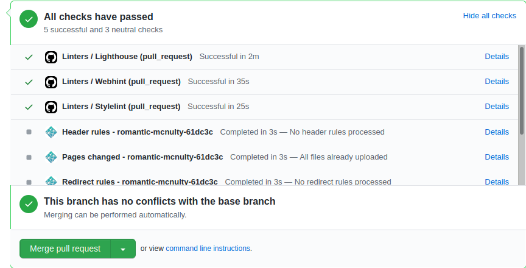

# Tactical Medical Supply - HTML Capstone Project (Online store)

This is Brandon's HTML Capstone project

This project was compiled by Brandon in the HTML/CSS section of the Microverse course work as the HTML/CSS capstone project. It involved using this design: <https://www.behance.net/gallery/24796463/ZATTIX> to create a real-world-like project. Modeled after an electronics store, this is a medical supply store.

It includes a main page and a search page with all relevant links working, except the shopping cart, product request, page settings, login pages, and search results page numbers.

It includes two main breakpoints for above 768px and below 768px to accommodate desktop and mobile users.

Colors #d35266, #888, and #383838, as well as font styles Gotham-light, Gotham-bold, Helvetica-light, Helvetica-medium, and Helvetica-bold were used to match to design specs.

Particularly noteworthy is the sale class which can be applied to any card to create a sale banner, cross out the normal price, and add the sale price.

## Built With

-   HTML and CSS
-   Bootstrap
-   Atom
-   Ubuntu
-   <https://validator.w3.org> was used to validate the HTML code in this project
-   Linters used include Lighthouse, Webhint, and Stylelint

## Live Demo

[Live Demo Link](https://romantic-mcnulty-61dc3c.netlify.app/home.html)

## Getting Started

To get your own copy of my project simply clone the repository to your local machine.

## Author

👤 **Brandon Defoe**

-   Github: [@defoebrand](https://github.com/defoebrand)
-   Gmail: defoe.brand@gmail.com

## 🤝 Contributing

Contributions, issues and feature requests are welcome!

Feel free to check the [issues page](issues/).

## Show your support

Give a ⭐️ if you like this project!

## Acknowledgments

\- [Mohammed Awad](https://www.behance.net/M_Awad) as designer of this layout
\- Thank you to the TSEs for your encouraging words!

## 📝 License

This project is licensed by Microverse and Notion.so
